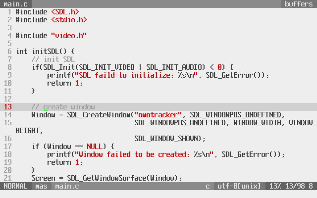
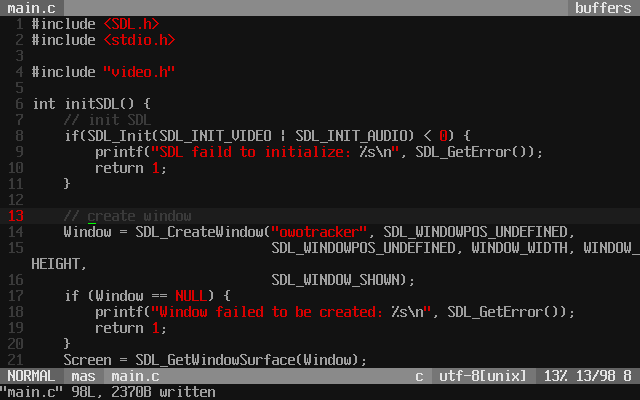

# honeywell.vim
Honeywell terminal inspired vim colour scheme. Grey and white with red highlights.





## Installation

Copy the color scheme to your `~/.vim/colors/` folder or use your preferred plugin manager.

## Usage

```
:colorscheme honeywell
```
